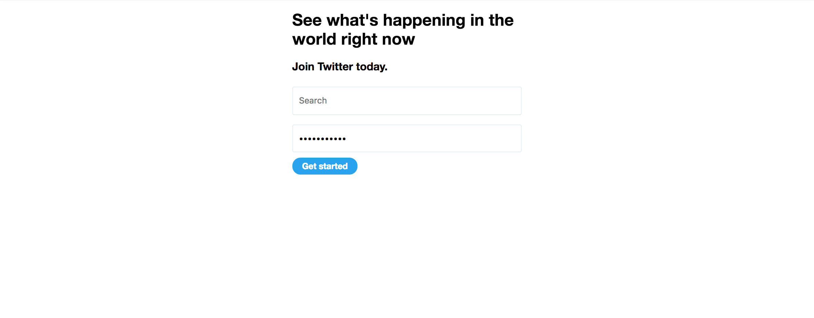

# Twitter Login

## Steps

- Create a project folder called “activity--css-basics”.
- Use the below code:

```html
<div class="wrapper">
  <h1>See what's happening in the world right now</h1>
  <h2>Join Twitter today.</h2>
  <form>
    <input type="text">
    <input type="text">
    <button>Get started</button>
  </form>
</div>
```

## Indications

- Write the correct HTML structure.
- Write styles in `main.css` (You need to create this file and link it).
- Use the correct `input` element to write a password.

```
DESIGN SPECS
===========================================
Title
  font size: 27px
  spacing between lines of text: 32px
Subtitle
  font size: 18px
Inputs
  dimensions: 376px * 46px
  corners radius: 3px
  space between inputs: 8px
  border color: E6ECF0
Button
  font size: 14px
  space between content and border: 6px on top/bottom and 16px on left/right
  corners radius: 100px
  fill color: 1DA1F2
```

## Final Result



**Try to search on Google about “placeholder input html” and see where can be useful.**
